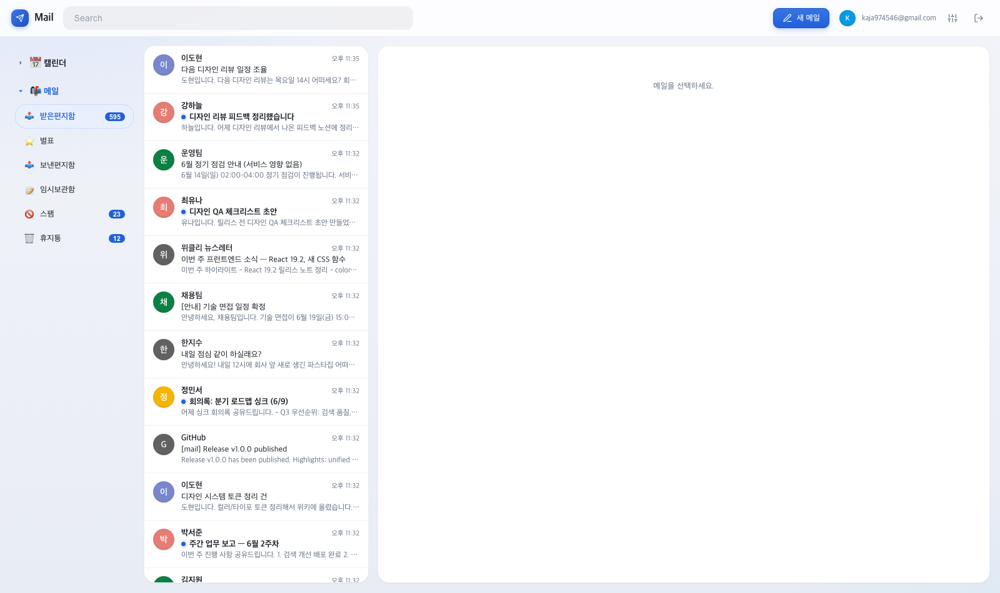
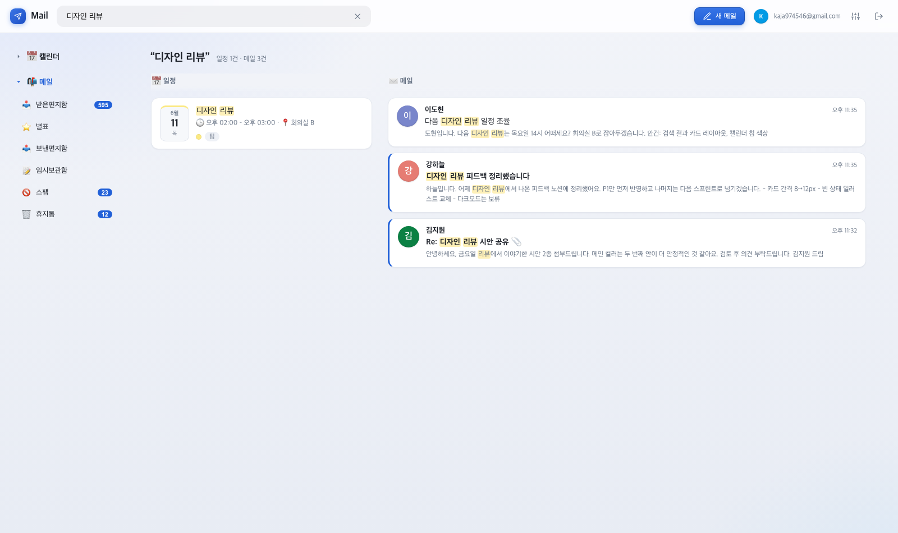
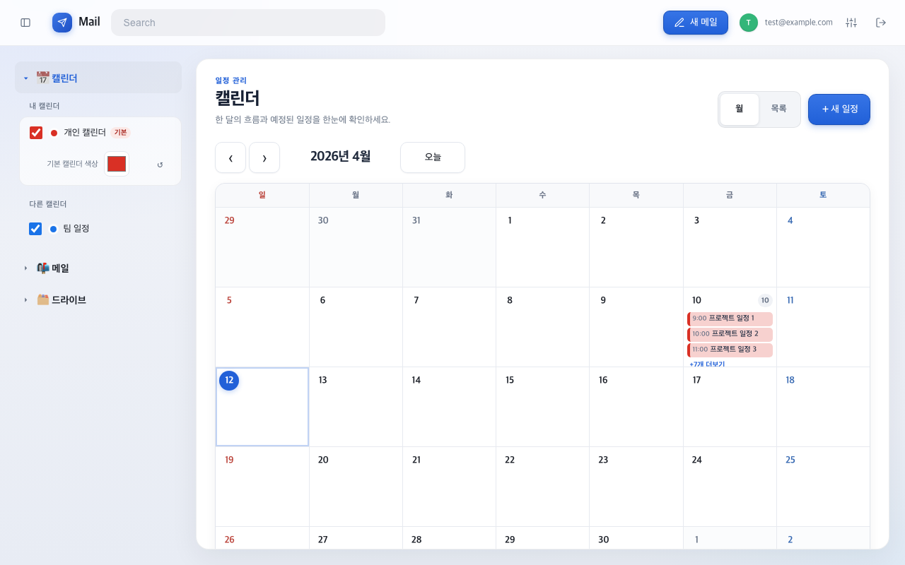

# 📮 Mail

> **Gmail · Google Calendar · Google Drive를 한 화면에서.**<br>
> 내 컴퓨터에서만 조용히 돌아가는 개인용 Google 워크스페이스입니다.

회사 보안망이 Gmail 웹사이트를 막아도 Google API와 OAuth가 허용된 환경이라면 메일·일정·파일을 평소처럼 사용할 수 있어요. 데이터는 **Google ↔ 내 컴퓨터** 사이에서만 오가며, 중간 서버는 없습니다.

[**지금 열기 → http://localhost:8787**](http://localhost:8787) · [Claude Code로 설치](#claude-code-install) · [직접 설치](#-직접-설치하기-1회-약-10분) · [문제 해결](#-자주-묻는-질문--문제-해결)

---

## 목차

1. [화면 미리보기](#-화면-미리보기)
2. [무엇을 할 수 있나요](#-무엇을-할-수-있나요)
3. [답장과 전달](#reply-forward)
4. [전체메일 안전하게 정리하기](#bulk-cleanup)
5. [Claude Code로 설치하기](#claude-code-install)
6. [직접 설치하기 (1회, 약 10분)](#-직접-설치하기-1회-약-10분)
7. [매일 쓰는 법](#-매일-쓰는-법)
8. [기능 사용법](#-기능-사용법)
9. [자주 묻는 질문 · 문제 해결](#-자주-묻는-질문--문제-해결)
10. [내 데이터는 안전한가요](#-내-데이터는-안전한가요)
11. [개발자를 위한 정보](#-개발자를-위한-정보)

---

## 🖼 화면 미리보기

**받은편지함**



**통합 검색 — 한 번 검색하면 일정 · 메일 · 파일이 나란히**



**캘린더 — 월 그리드**



## ✨ 무엇을 할 수 있나요

### 🧭 화면 구성
- 왼쪽 위에서 **메일 · 드라이브 · 캘린더**를 바로 전환하며, 현재 선택한 서비스는 파란색 탭으로 분명하게 표시됩니다.
- 편지함·파일·일정·첨부·보관·휴지통 등 주요 동작은 같은 선 굵기의 **SVG 아이콘**으로 통일해 운영체제마다 모양이 달라지는 이모지를 사용하지 않습니다.
- 마우스뿐 아니라 키보드 포커스, 44px 이상 조작 영역, 모션 감소 설정까지 지원합니다.

### ✉️ 메일
- 받은편지함·라벨·대화(스레드) 보기, 스크롤만 내리면 이전 메일이 계속 이어져요
- 목록에서 메일을 고르면 오른쪽 읽기 패널에 바로 펼쳐집니다. 창이 좁거나(가로 900px 이하) 통합 검색 결과에서 열 때는 같은 읽기 화면이 가운데 팝업으로 뜹니다
- 키보드 단축키 안내는 목록 위쪽 **?** 버튼에 들어 있어요 (`j`/`k` 이전·다음, `e` 보관, `#` 삭제, `c` 새 메일, `/` 검색, `u` 목록으로)
- 답장 · 전체답장 · 전달 · **대화 전체 전달** — 전체 전달은 메일마다 보낸사람·날짜·제목이 분리된 카드로 보여요
- 목록과 대화마다 **읽음 / 안읽음 상태가 글자로 표시**되어 한눈에 구분돼요
- 받는사람 자동완성 (주소록 + 자주 주고받은 사람)
- **보내기 취소** — 보내기를 눌러도 몇 초간 붙잡아 둡니다. "실행취소"를 누르면 작성창이 그대로 돌아와요
- **서식 있는 서명** — 굵게, 글꼴, 링크가 들어간 서명을 만들어 두면 모든 메일 끝에 자동으로 붙어요
- **나만의 기본 글꼴** — 설정에서 글꼴·크기를 고르면 받는 사람에게도 그 글꼴로 보여요
- **라이트·다크 모드** — 기본은 시스템 설정을 따르고, 상단 ☾/☀ 버튼으로 바로 바꿀 수 있어요. 메일 본문은 다크에서도 보낸 사람이 만든 그대로 보여요
- 첨부가 25MB를 넘으면 자동으로 Drive 링크로 바꿔서 보내줘요 (Gmail 웹과 동일)
- 받은 첨부는 첨부파일 옆 **클라우드 저장 버튼**으로 내 Drive에 바로 저장
- Gmail 요청이 몰리면 실패한 메일만 추려 자동으로 다시 요청하고, 성공한 메일은 중복 조회하지 않습니다.
- 새 메일이 오면 데스크톱 알림

### 📅 캘린더
- 월 보기 / 목록 보기, **이전·다음·오늘 버튼으로 월 이동**
- Notion·Linear 계열의 차분한 화면 구조 — 일정 관리, 보기 전환, 새 일정, 월 탐색의 우선순위가 한눈에 보입니다.
- 월과 목록을 오갈 때 같은 날짜 맥락을 유지해 탐색 위치를 잃지 않습니다.
- 날짜를 클릭하면 바로 일정 만들기 — **참석자 초대, 알림(10분 전 등), Google Meet 화상회의**까지 한 화면에서
- 메일을 읽다가 **일정 버튼**을 누르면 그 메일 내용으로 일정이 만들어져요
- 캘린더는 처음에 모두 표시되며, 기본 캘린더는 항상 목록과 새 일정 선택의 첫 번째 항목이고 기본 빨강색으로 시작합니다. 각 캘린더는 필요할 때 숨겼다가 다시 표시할 수 있습니다.
- 캘린더 색은 목록의 작은 색상점에서 바꿀 수 있습니다. 이 브라우저에만 저장되어 Google Calendar의 색이나 일정 데이터를 바꾸지 않으며, 언제든 기본값으로 되돌릴 수 있습니다.
- 월 그리드는 달에 따라 4·5·6주로 늘어나며 일정이 많아도 `더보기`로 접지 않고 모든 일정 칩을 직접 표시합니다. 칩은 12px 이상의 읽을 수 있는 글자 크기를 유지하고, 밀집 날짜는 해당 주 행과 캘린더 화면 자체가 늘어납니다.
- 1280·1024·768px 반응형 화면, 키보드 포커스, WCAG AA 대비, 모션 감소 설정을 검증합니다.

### 🗂 드라이브
- 폴더 탐색, 검색, 업로드 · 다운로드, 새 폴더, 이름 바꾸기
- 삭제는 항상 휴지통으로만 — 실수로 영구 삭제될 일이 없어요

### 🔍 통합 검색
- 검색 한 번에 **일정 · 메일 · 드라이브 파일**이 세 칼럼으로 나란히
- 결과에서 메일을 누르면 **화면 가운데 팝업**으로 열립니다. 검색 결과는 뒤에 그대로 남아 있고, 팝업 왼쪽 위 **⤢**를 누르면 화면 가득 채우기로 바뀌어요 (이 상태는 다음에 열 때도 유지)
- 팝업을 띄운 채로 `j` / `k` 로 이전·다음 결과를 계속 넘겨볼 수 있고, `Esc` · 배경 클릭 · `u` 중 아무거나로 한 번에 닫힙니다
- Gmail 검색 문법 그대로: `from:aaa@x.com` `has:attachment` `is:unread newer_than:7d`

---

<a id="reply-forward"></a>

## ↩️ 답장과 전달

긴 대화도 메일마다 경계가 명확하게 보이도록 구성했습니다.

| 동작 | 포함되는 내용 |
|---|---|
| **답장** | 선택한 메일의 보낸사람에게 답장. 해당 메일의 직접 작성 내용만 한 번 인용 |
| **전체답장** | 보낸사람·받는사람·참조에 답장. 내 기본 주소와 send-as 별칭은 자동 제외 |
| **전달** | 선택한 메일 한 건과 그 메일의 첨부파일 전달 |
| **대화 전체 전달** | 대화의 모든 메일을 시간순 독립 카드로 전달 |

전체 전달의 각 카드에는 **순번 · 보낸사람 · 날짜 · 제목 · 받는사람 · 참조 · 본문**이 표시됩니다. 최신 답장 안에 이미 들어 있던 과거 인용을 다시 붙이지 않으므로 같은 내용이 반복되지 않아요. 인라인 이미지도 원본 메일별로 구분해 다른 이미지로 바뀌지 않게 처리합니다.

> 메일 읽기 화면에서 **↪ 전달**은 현재 메일만, **↪↪ 전체 전달**은 대화 전체를 보냅니다.

<a id="bulk-cleanup"></a>

## 🧹 전체메일 안전하게 정리하기

현재 화면에 불러온 25개뿐 아니라 편지함 전체를 한 번에 읽음·안읽음·휴지통 처리할 수 있습니다.

1. 사이드바에서 **📨 전체메일** 또는 원하는 편지함 선택
2. 목록 상단 체크박스로 현재 페이지 전체 선택
3. **이 보기의 모든 메일 선택** 클릭
4. **읽음 / 안읽음 / 휴지통** 중 작업 선택
5. 서버가 확인한 **정확한 메일 개수**를 보고 최종 확인

> [!IMPORTANT]
> 삭제는 영구삭제가 아니라 **휴지통 이동**입니다. 새로 도착한 메일은 확정된 작업 대상에 끼지 않으며, 대량 작업은 Gmail API 제한에 맞춰 나눠 처리합니다.

- **전체메일**은 Gmail의 전체보관함과 같은 범위이며 스팸·휴지통은 별도 편지함에서 확인합니다.
- 완료 후 성공·실패 개수를 화면에 표시합니다.

---

<a id="claude-code-install"></a>

## 🤖 Claude Code로 설치하기 (macOS · Windows)

터미널 명령이 낯설다면 Claude Code에 저장소 주소와 아래 문장을 그대로 붙여넣으세요. 저장소의 [`CLAUDE.md`](CLAUDE.md)에 운영체제별 설치 순서, 필요한 Google 서비스, 연결 정보를 넣을 위치, 검증 방법이 적혀 있어 Claude Code가 실제 파일을 읽고 안내할 수 있습니다.

```text
https://github.com/sj00c/mail 을 이 컴퓨터에 설치해줘.
저장소를 받은 뒤 CLAUDE.md와 README.md를 먼저 읽고 그대로 진행해.
내 운영체제가 macOS인지 Windows인지 확인해서 맞는 설치 방법만 사용하고,
Google Cloud에서 내가 직접 해야 하는 작업은 링크와 클릭 순서로 한 단계씩 알려줘.
Client Secret은 채팅에 붙여넣게 하지 말고, 저장소의 .env 파일에 내가 직접 넣게 해줘.
설치가 끝나면 빌드와 http://localhost:8787/auth/status 응답까지 확인해줘.
```

### Claude Code가 처리하는 것

- 저장소 내려받기와 현재 운영체제 확인
- 필요한 Google API 네 개와 OAuth 설정 위치 안내
- `.env.example`을 `.env`로 복사하고 입력할 항목 설명
- macOS에서는 `deploy/install.sh`, Windows에서는 `deploy\install.ps1` 실행
- 의존성 설치, 프로덕션 빌드, 자동 실행 등록, 로컬 서버 확인
- 실패 시 로그와 설정을 확인해 원인 설명

### 내가 직접 해야 하는 것

- Google Cloud 화면에서 프로젝트와 OAuth 클라이언트 만들기
- 발급받은 `GOOGLE_CLIENT_ID`, `GOOGLE_CLIENT_SECRET`을 **내 컴퓨터의 `.env` 파일에만** 입력하기
- 첫 실행 때 Google 로그인 및 권한 승인하기

> [!IMPORTANT]
> 이 앱은 API Key가 아니라 **웹 애플리케이션용 OAuth Client ID와 Client Secret**을 사용합니다. Client Secret을 Claude 채팅, GitHub, 메신저에 붙여넣지 마세요. 저장소가 비공개라면 Claude Code가 내려받을 수 있도록 해당 컴퓨터에서 먼저 GitHub 로그인이 되어 있어야 합니다.

Claude Code 없이 직접 설치하려면 아래 순서를 따르면 됩니다.

---

## 🚀 직접 설치하기 (1회, 약 10분)

처음 한 번만 아래 순서대로 진행하면 됩니다. 필요한 것은 **Google 계정**, **인터넷 연결**, **명령을 붙여넣을 터미널 창**뿐입니다. Google Cloud 결제수단은 필요하지 않습니다.

> [!NOTE]
> 흔히 “API Key를 받는다”고 표현하지만, 이 앱은 **API Key를 사용하지 않습니다.** 내 Gmail에 안전하게 로그인할 수 있도록 Google에서 **Client ID**와 **Client Secret**이라는 연결 정보 두 개를 발급받습니다. Google 화면에서 **API 키 만들기**는 누르지 마세요.

### ① Google 연결 정보 만들기

Google Cloud 화면에서는 상단에 표시되는 프로젝트 이름이 계속 **Mail**인지 확인하세요. 다른 프로젝트가 선택되면 아래 설정이 서로 엇갈릴 수 있습니다.

#### 1. Google Cloud 프로젝트 만들기

1. 사용할 Google 계정으로 [Google 로그인](https://accounts.google.com)을 합니다.
2. [프로젝트 만들기](https://console.cloud.google.com/projectcreate)를 엽니다.
3. 프로젝트 이름에 `Mail`을 입력하고 **만들기**를 누릅니다.
4. 생성이 끝나면 화면 위쪽 프로젝트 선택란에서 방금 만든 **Mail**을 선택합니다.

#### 2. 필요한 Google 서비스 네 개 켜기

아래 링크를 하나씩 열고 **사용** 버튼을 누릅니다. 이미 켜져 있으면 **관리**라고 표시됩니다.

| 켜야 하는 서비스 | 앱에서 사용하는 곳 |
|---|---|
| [Gmail API](https://console.cloud.google.com/apis/library/gmail.googleapis.com) | 메일 읽기·쓰기·정리 |
| [Google Calendar API](https://console.cloud.google.com/apis/library/calendar-json.googleapis.com) | 일정 보기·등록·수정 |
| [Google Drive API](https://console.cloud.google.com/apis/library/drive.googleapis.com) | 파일 보기·저장·첨부 |
| [People API](https://console.cloud.google.com/apis/library/people.googleapis.com) | 받는사람 주소 자동완성 |

> 각 링크를 열 때 상단 프로젝트가 **Mail**인지 다시 확인하세요. `CalDAV API`가 아니라 **Google Calendar API**를 켜야 합니다.

#### 3. 로그인 허용 화면 만들기

1. [Google Auth Platform](https://console.cloud.google.com/auth/overview)을 엽니다.
2. **시작하기**를 누릅니다.
3. 앱 이름에는 `Mail`, 사용자 지원 이메일에는 **본인 이메일**을 선택합니다.
4. 대상 또는 사용자 유형은 **외부(External)**를 선택합니다.
5. 연락처 이메일에도 본인 이메일을 입력하고 생성을 마칩니다.
6. 왼쪽의 **대상(Audience)**을 열고 **테스트 사용자 추가**를 누릅니다.
7. 이 앱에서 실제로 로그인할 **본인 Gmail 주소**를 정확히 추가합니다.
8. 게시 상태는 **테스트 중(Testing)** 그대로 둡니다. 개인 사용이라 별도의 Google 심사를 받을 필요가 없습니다.

> 본인 주소를 테스트 사용자에 넣지 않으면 로그인할 때 `403 access_denied`가 표시됩니다. 회사나 학교 계정으로 로그인할 예정이라면 그 주소도 테스트 사용자에 추가하세요.

#### 4. 앱이 사용할 권한 다섯 개 선택하기

1. [데이터 액세스](https://console.cloud.google.com/auth/scopes)를 엽니다.
2. **범위 추가 또는 삭제(Add or remove scopes)**를 누릅니다.
3. 아래 주소를 하나씩 검색해 체크합니다.

| 선택할 권한 | 필요한 이유 |
|---|---|
| `https://www.googleapis.com/auth/gmail.modify` | 메일 읽기·발송·정리 |
| `https://www.googleapis.com/auth/calendar` | 일정 보기·등록·수정 |
| `https://www.googleapis.com/auth/drive` | 기존 Drive 파일 보기·저장 |
| `https://www.googleapis.com/auth/contacts.readonly` | Google 주소록 자동완성 |
| `https://www.googleapis.com/auth/contacts.other.readonly` | 자주 사용한 주소 자동완성 |

4. 다섯 개가 선택됐는지 확인하고 **업데이트 → 저장**을 누릅니다.

> 이 권한들은 메일·일정·파일을 실제로 다루기 위해 필요합니다. 앱을 **테스트 중**으로 두고 등록한 테스트 사용자만 쓰면 Google에 게시하거나 심사를 신청하지 않아도 됩니다.

#### 5. Client ID와 Client Secret 발급받기

1. [클라이언트 만들기](https://console.cloud.google.com/auth/clients)를 엽니다.
2. **클라이언트 만들기**를 누릅니다.
3. 애플리케이션 유형은 반드시 **웹 애플리케이션**을 선택합니다.
4. 이름에는 `Mail Local`을 입력합니다.
5. **승인된 자바스크립트 원본**은 비워둡니다.
6. **승인된 리디렉션 URI**에서 **URI 추가**를 누르고 아래 주소를 그대로 붙여넣습니다.

```text
http://localhost:8787/auth/callback
```

7. **만들기**를 누릅니다.
8. 표시되는 **Client ID**와 **Client Secret**을 각각 복사해 안전한 곳에 잠시 보관합니다.

주소는 `http`로 시작하고, 끝에 `/`가 없으며, 숫자가 `8787`이어야 합니다. Client Secret은 비밀번호와 같으므로 다른 사람에게 보내거나 화면을 공유하지 마세요.

#### Google 설정 완료 확인표

| 확인할 항목 | 정상 상태 |
|---|---|
| 프로젝트 | Mail 프로젝트가 선택됨 |
| 사용 설정한 서비스 | Gmail·Calendar·Drive·People API, 총 4개 |
| 로그인 대상 | 테스트 사용자에 실제 Gmail 주소가 있음 |
| 데이터 액세스 | 위 권한 5개가 선택됨 |
| 클라이언트 유형 | 웹 애플리케이션 |
| 리디렉션 주소 | `http://localhost:8787/auth/callback` |
| 발급 결과 | Client ID와 Client Secret을 복사해 둠 |

### ② 앱을 받고 `.env` 입력하기

#### 1. 앱 파일 받기

GitHub에 로그인한 뒤 [최신 버전 ZIP 내려받기](https://github.com/sj00c/mail/archive/refs/heads/main.zip)를 눌러 압축을 풉니다. `404` 화면이 나오면 저장소 접근 권한이 없는 계정이므로 관리자에게 초대를 요청해야 합니다.

압축을 푼 `mail-main` 폴더는 **문서**처럼 나중에도 그대로 둘 장소로 옮겨주세요. 설치 후 폴더를 옮기면 자동 실행을 다시 등록해야 합니다.

#### 2. 앱 폴더에서 명령 창 열기

- **macOS:** Finder에서 `mail-main` 폴더를 선택하고 우클릭 → **서비스 → 폴더에서 새로운 터미널**. 메뉴가 없다면 터미널을 열고 `cd `를 입력한 뒤 해당 폴더를 창으로 끌어놓고 Enter를 누릅니다.
- **Windows:** 파일 탐색기에서 `mail-main` 폴더를 연 뒤 위쪽 주소창에 `powershell`을 입력하고 Enter를 누릅니다.

#### 3. `.env` 파일 만들고 연결 정보 붙여넣기

**macOS**

```sh
cp .env.example .env
open -e .env
```

**Windows PowerShell**

```powershell
Copy-Item .env.example .env
notepad .env
```

열린 파일에서 **첫 두 줄의 `=` 오른쪽만** 앞에서 발급받은 값으로 바꿉니다. 아래 두 줄의 주소와 숫자는 그대로 둡니다.

```text
GOOGLE_CLIENT_ID=여기에_Client_ID_붙여넣기
GOOGLE_CLIENT_SECRET=여기에_Client_Secret_붙여넣기
OAUTH_REDIRECT=http://localhost:8787/auth/callback
PORT=8787
```

- 따옴표나 앞뒤 공백을 넣지 않습니다.
- Client ID는 보통 `.apps.googleusercontent.com`으로 끝납니다.
- Client Secret은 절대 GitHub, 메신저, 이메일에 올리지 않습니다.
- 편집을 마치면 파일을 **저장**하고 닫습니다.

<a id="run-app"></a>
<a id="auto-start"></a>

### ③ 설치 스크립트 한 번 실행하기

> **여기서부터는 한 번이면 끝입니다.** 아래에서 내 컴퓨터에 맞는 명령 하나만 실행하면 필요한 프로그램 설치, 앱 준비, 빌드, 자동 실행 등록까지 모두 처리하고 브라우저를 엽니다.

**macOS**

```sh
bash deploy/install.sh
```

**Windows PowerShell**

```powershell
powershell -ExecutionPolicy Bypass -File deploy\install.ps1
```

> Windows는 **Windows 10 버전 1809 이상**이 필요합니다.

설치 스크립트가 자동으로 처리하는 내용:

1. `.env`에 실제 Client ID와 Client Secret이 들어갔는지 확인
2. Bun이 없으면 공식 설치 프로그램으로 자동 설치
3. 앱에 필요한 파일 설치 및 프로덕션 빌드
4. 로그인할 때마다 앱이 자동으로 켜지도록 등록
5. `localhost:8787`이 실제로 열리는지 확인(Windows는 실제 경과시간 기준 60초)한 뒤 브라우저 실행

중간에 잘못된 Client ID, 빈 Client Secret, 포트와 리디렉션 주소의 불일치, 이미 다른 프로그램이 쓰고 있는 포트가 발견되면 무엇을 고쳐야 하는지 표시하고 설치를 멈춥니다. 서버가 떠다 죽으면 로그의 마지막 부분을 바로 보여줍니다. 연결 정보의 실제 값은 화면이나 로그에 출력하지 않습니다.

Windows에서는 단계별 소요시간, Bun 경로·버전, 명령 출력과 실패 단계를 `%LOCALAPPDATA%\MailLocal\install.log`에 저장합니다(재설치하면 최근 시도 내용으로 교체). 서버 출력은 같은 폴더의 `mail.local.log`에 남습니다. 로그인 시에는 설치 때 확인한 Bun으로 이미 빌드한 앱만 실행하며, 다시 빌드하지 않습니다. 소스를 업데이트하거나 폴더를 옮겼다면 설치 명령을 다시 실행하세요.

`설치가 끝났습니다.`가 표시되면 명령 창을 닫아도 됩니다. 브라우저가 자동으로 열리지 않았다면 [http://localhost:8787](http://localhost:8787)을 직접 여세요.

#### 처음 한 번 Google 로그인

1. **Gmail 연결하기**를 누릅니다.
2. 테스트 사용자로 등록한 Google 계정을 선택합니다.
3. 요청되는 Gmail·캘린더·드라이브·주소록 권한을 모두 허용합니다.
4. **Google에서 확인하지 않은 앱** 경고가 나오면 **고급 → Mail(으)로 이동**을 선택합니다. 본인이 만든 개인용 앱이라 표시되는 정상 안내입니다.
5. 받은편지함이 보이면 모든 설치가 끝난 것입니다.

> **최종 사용 흐름:** Google 연결 정보 발급 → `.env`에 두 값 입력 → 설치 스크립트 한 번 실행 → 앞으로는 [http://localhost:8787](http://localhost:8787)만 열기

자동 실행을 해제할 때만 아래 명령을 사용합니다.

| 내 컴퓨터 | 자동 실행 해제 |
|---|---|
| **macOS** | `bash deploy/uninstall.sh` |
| **Windows PowerShell** | `powershell -File deploy\uninstall.ps1` |

---

## 📌 매일 쓰는 법

- 접속 주소는 항상 → **http://localhost:8787** (북마크 추천)
- 노트북을 닫았다 열어도, Wi-Fi를 바꿔도 그대로 이어집니다

## 💡 기능 사용법

| 하고 싶은 것 | 이렇게 하세요 |
|---|---|
| 서명 만들기 | 왼쪽 아래 **⚙ 설정** → 서명 칸에 입력 (굵게·글꼴·링크 툴바 지원) → 저장 |
| Gmail에 있던 서명 가져오기 | ⚙ 설정 → **Gmail 서명 가져오기** → 저장 |
| 기본 글꼴 바꾸기 | ⚙ 설정 → **기본 글꼴**에서 글꼴·크기 선택 → 저장. 받는 사람에게도 똑같이 보여요 |
| 잘못 보낸 메일 붙잡기 | 보내기를 누르면 화면 아래 **"실행취소"** 토스트가 몇 초간 떠요. 대기시간은 ⚙ 설정에서 0~20초 |
| 다크 모드 | 상단 오른쪽 **☾/☀** 버튼으로 바로 전환. 시스템 설정을 따르게 하려면 ⚙ 설정 → **테마** → 시스템 설정 따르기 |
| 문장 일부만 글꼴 바꾸기 | 작성창에서 문장을 드래그 → 툴바의 글꼴/크기 선택 |
| 사람 초대하는 일정 | 일정 만들 때 **참석자** 칸에 이메일 입력 → 저장하면 초대 메일이 자동 발송 |
| 화상회의 잡기 | 일정 만들 때 **Meet 추가** 체크 → 저장하면 Meet 링크가 생겨요 |
| 메일을 일정으로 | 메일 읽는 화면의 **일정** 버튼 |
| 첨부를 Drive에 보관 | 첨부 이름 옆 **클라우드 저장** 버튼 |
| 다음 달 일정 훑기 | 캘린더 월 화면의 **‹ / › 버튼** |
| 지난 메일 더 보기 | 목록을 그냥 아래로 스크롤 — 자동으로 이어서 불러와요 |
| 여러 메일 한꺼번에 정리 | 목록에서 체크박스 선택 (Shift-클릭으로 범위 선택) → 읽음/별표/보관/휴지통 |
| 현재 페이지를 넘어 전체 정리 | **전체메일** 또는 원하는 편지함 → 상단 전체 선택 → **이 보기의 모든 메일 선택** → 읽음/안읽음/휴지통. 실행 전에 서버가 정확한 개수를 다시 확인해 보여줘요 |
| 화면을 넓게 쓰기 | 왼쪽 위 **▥ 버튼**(또는 `⌘\` / `Ctrl+\`)으로 사이드바를 접었다 펴요. 접힌 상태는 다음에 열 때도 그대로 |
| 팝업을 더 크게 | 작성창·일정 팝업은 오른쪽 위 **⤢**로 화면 꽉 채우기, 오른쪽 아래 **모서리를 끌면** 원하는 크기로. 크기는 팝업별로 기억되고 모서리 **더블클릭**하면 기본값 |
| 검색 결과의 메일을 크게 읽기 | 팝업 왼쪽 위 **⤢** 누르면 화면 가득. 다음에 열 때도 그 상태로 열려요. 닫기는 `Esc` · 배경 클릭 · `u` |
| 단축키가 뭐였더라 | 메일 목록 위쪽 **?** 버튼 |
| 정교하게 검색 | `from:` `subject:` `has:attachment` `is:unread` `newer_than:7d` `label:업무` 등 Gmail 문법 그대로 |

## ❓ 자주 묻는 질문 · 문제 해결

<details>
<summary><b>전체 전달을 했는데 같은 내용이 반복되나요?</b></summary>

현재 버전은 각 메일의 직접 작성 본문만 추출해 독립 카드로 전달합니다. 이전 빌드가 브라우저에 남아 있다면 `⌘R` 또는 `Ctrl+R`로 새로고침하세요. 카드마다 보낸사람·날짜·제목이 각각 보여야 합니다.
</details>

<details>
<summary><b>“이 보기의 모든 메일 선택”은 정말 전체 메일인가요?</b></summary>

네. 화면에 보이는 행만 세는 것이 아니라 Gmail API의 모든 페이지를 먼저 조회해 정확한 대상을 고정합니다. 최종 확인창의 개수가 실제 작업 대상이며, 확인 이후 새로 도착한 메일은 제외됩니다.
</details>

<details>
<summary><b>설치 중 Bun을 찾지 못했다는 오류가 나요</b></summary>

설치 스크립트가 Bun을 자동으로 내려받습니다. 인터넷 연결을 확인하고 [설치 ③](#run-app)의 명령을 다시 실행하세요. 회사 보안 프로그램이 `bun.com` 또는 `bun.sh` 다운로드를 막는 경우에는 해당 주소를 허용한 뒤 다시 실행해야 합니다.
</details>

<details>
<summary><b>Gmail 연결하기를 눌렀는데 로그인 오류가 나요</b></summary>

`.env` 파일을 저장했는지, Client ID와 Client Secret의 앞뒤에 따옴표·공백이 없는지 확인하세요. 수정했다면 [설치 ③](#run-app)의 설치 명령을 다시 실행하세요. 스크립트가 기존 설치 설정을 갱신하고 서버를 다시 시작합니다.
</details>

<details>
<summary><b>로그인하려는데 "403 access_denied"가 떠요</b></summary>

Google 콘솔의 **테스트 사용자**에 본인 Gmail 주소를 추가하지 않았을 때 나는 오류예요. [직접 설치의 ①-3단계](#-직접-설치하기-1회-약-10분)를 확인하세요.
</details>

<details>
<summary><b>"redirect_uri_mismatch"가 떠요</b></summary>

콘솔에 등록한 리디렉션 URI가 `http://localhost:8787/auth/callback` 과 한 글자라도 다르면 나는 오류입니다 (`https`나 끝의 `/` 주의).
</details>

<details>
<summary><b>"has not been used in project" 403이 떠요</b></summary>

API 4개(Gmail·Calendar·Drive·People) 중 켜지 않은 게 있어요. 설치 ①-2단계의 링크에서 **사용** 버튼을 눌러주세요.
</details>

<details>
<summary><b>“Gmail 요청이 잠시 몰렸습니다”가 표시돼요</b></summary>

Google이 짧은 시간에 들어온 요청을 일시 제한한 상태입니다(HTTP 429). 앱은 성공한 메일을 다시 요청하지 않고 **실패한 메일만 1초 → 2초 → 4초 → 8초 간격으로 자동 재시도**합니다. 제한이 길게 이어지면 안내가 표시되며, 잠시 기다린 뒤 편지함을 다시 열거나 새로고침하면 됩니다. 이메일 주소나 로그인 정보가 잘못됐다는 뜻은 아닙니다.
</details>

<details>
<summary><b>자꾸 로그인 화면으로 돌아가요</b></summary>

Google이 로그인 권한을 만료하거나 사용자가 권한을 회수한 경우예요. **Gmail 연결하기**로 다시 로그인하면 됩니다. 개인용 앱을 **테스트 중** 상태로 사용하면 약 7일마다 다시 로그인이 필요할 수 있으며 정상입니다. 캘린더나 드라이브 권한만 작동하지 않을 때도 로그아웃 후 다시 로그인해 새 권한을 허용하세요.
</details>

<details>
<summary><b>페이지가 안 열려요 (localhost:8787)</b></summary>

서버가 꺼져 있는 상태예요. [설치 ③](#run-app)의 설치 명령을 다시 실행하면 필요한 파일을 확인하고 자동 실행까지 다시 등록합니다.
</details>

<details>
<summary><b>설치 중 Timeout / 응답 확인 시간 초과 / 서버 종료가 떠요</b></summary>

Timeout이라는 말만으로 느린 PC나 다운로드 문제라고 판단할 수 없습니다. 마지막 서버 응답 확인 단계의 시간 초과라면 다운로드·빌드는 이미 끝났지만, 앱이 정상 실행됐다는 뜻은 아닙니다.

- **Windows**: 화면의 **실패 단계**와 `%LOCALAPPDATA%\MailLocal\install.log` 마지막 부분을 확인하세요. 파일 탐색기 주소창에 `%LOCALAPPDATA%\MailLocal`을 입력하면 로그 폴더가 열립니다. 실행 확인에서 실패했다면 작업 상태·종료 코드와 서버 로그 마지막 25줄도 설치 로그에 기록됩니다.
- **macOS**: 화면에 나온 로그 마지막 부분과 `~/Library/Logs/mail.local.log`를 확인하세요.
- **작업이 종료된 경우**: 기다리는 시간을 늘리는 대신 기록된 오류를 먼저 해결해야 합니다. Windows 예약 작업은 실패 후 1분 간격으로 재시도합니다.
- **작업이 실행 중이거나 대기 중인 경우**: 늦은 시작일 수도 있지만 확정할 수는 없습니다. 로그를 확인하고 주소를 직접 열어 보세요.
- **포트 점유**: 표시된 프로그램과 PID를 확인하세요. `bun`은 다른 앱도 사용하는 실행 프로그램이므로 이름만 보고 종료하지 마세요. 다른 앱의 포트라면 아래 "포트 바꾸기"를 따르세요.

오류를 전달할 때는 실패 단계와 마지막 오류 부분을 보내고, `.env`나 `server/.data/token.json`은 보내지 마세요. 로그에도 개인 경로나 오류에 포함된 개인정보가 있을 수 있으니 공유 전 확인하세요.
</details>

<details>
<summary><b>8787 포트를 다른 프로그램이 쓰고 있어요 — 포트 바꾸기</b></summary>

세 곳을 같은 번호로 맞추면 됩니다 (예: 8788).

1. `.env`에서 `PORT=8788`, `OAUTH_REDIRECT=http://localhost:8788/auth/callback`
2. [Google Cloud 콘솔 → OAuth 클라이언트](https://console.cloud.google.com/apis/credentials)의 **승인된 리디렉션 URI**에 `http://localhost:8788/auth/callback` 추가 (기존 8787은 두어도 됨)
3. 설치 명령을 다시 실행. 앞으로는 [http://localhost:8788](http://localhost:8788)로 엽니다.

리디렉션 URI를 콘솔에 추가하지 않으면 로그인할 때 `redirect_uri_mismatch`가 납니다.
</details>

<details>
<summary><b>다른 기기(폰 등)에서도 접속할 수 있나요?</b></summary>

기본적으로 안 됩니다 — 이 앱에는 별도의 비밀번호가 없어서, 일부러 내 컴퓨터 안에서만 열리게 잠가뒀어요. 그게 안전합니다.
</details>

## 🔒 내 데이터는 안전한가요

- **중간 서버가 없어요.** 이 앱은 내 컴퓨터에서 Google API와 직접 통신합니다. 메일 내용이 다른 곳으로 가지 않아요.
- **로그인 열쇠는 내 컴퓨터에만** 저장됩니다 (`server/.data/token.json`). 로그아웃하면 지워져요.
- **외부에서 접속 불가** — 서버가 내 컴퓨터 안(`127.0.0.1`)에만 열립니다.
- **메일 영구 삭제 불가** — 권한 자체를 휴지통까지만 받아서, 실수로도 완전 삭제는 일어나지 않아요.
- **악성 메일 방어** — 메일 속 HTML은 스크립트가 차단된 격리 화면에서만 열리고, 위험한 링크·자동이동은 제거됩니다.
- 요청하는 Google 권한: Gmail(읽기·발송·정리), 캘린더(일정 관리), 드라이브(파일 관리), 주소록(**읽기만** — 자동완성용).

---

## 🛠 개발자를 위한 정보

<details>
<summary>펼쳐보기 — 스택, 환경 변수, 프로젝트 구조</summary>

### 스택

| | |
|---|---|
| 백엔드 | Bun · Hono · Gmail / Calendar / Drive / People REST API |
| 프론트 | React 18 · Vite · React.lazy (캘린더·드라이브·통합검색은 첫 사용 시 로드) |
| 인증 | OAuth2 (state 검증, 토큰 원자적 저장/자동 갱신) |
| 아이콘 | 공용 React SVG 컴포넌트 (`web/src/ui/icons.tsx`) |

Gmail 메일 목록은 최대 50개씩 multipart batch로 조회합니다. 배치 내부의 `429`·`5xx` 응답은 성공 항목을 보존하고 실패 항목만 지수 백오프로 재요청하므로, 재시도 자체가 API 사용량을 불필요하게 늘리지 않습니다.

### 실행 모드

| 모드 | 명령 | 주소 | 용도 |
|---|---|---|---|
| 개발 | `bun run dev` | `localhost:5173` | 핫리로드 (Vite + API 서버) |
| 프로덕션 | `bun run build && bun run start` | `localhost:8787` | 일상 사용 — 단일 프로세스가 SPA까지 서빙 |

### 환경 변수 (`.env`)

| 변수 | 기본값 | 설명 |
|---|---|---|
| `GOOGLE_CLIENT_ID` | *(필수)* | OAuth 클라이언트 ID |
| `GOOGLE_CLIENT_SECRET` | *(필수)* | OAuth 클라이언트 시크릿 |
| `OAUTH_REDIRECT` | `http://localhost:<PORT>/auth/callback` | 콘솔 등록값과 정확히 일치해야 함. 비우면 PORT에서 유도 |
| `PORT` | `8787` | 1024~65535. 바꾸면 리디렉션 URI도 같은 포트로 바꾸고 콘솔에 등록해야 함 (설치 스크립트가 둘의 일치를 검사) |
| `HOST` | `127.0.0.1` | 바인드 주소. 요청 인증이 없으므로 LAN 노출 금지 |

### 권한 범위 (scope)

| Scope | 범위 |
|---|---|
| `gmail.modify` | 읽기·발송·라벨·보관·휴지통 (영구 삭제 불가) |
| `calendar` | 일정 CRUD (참석자 초대 `sendUpdates`, Meet 생성 `conferenceData`) |
| `drive` | 탐색·업로드·다운로드·휴지통 + 대용량 첨부 링크 공유 |
| `contacts.readonly` + `contacts.other.readonly` | 읽기 전용 자동완성 |

### 프로젝트 구조

```
server/
  index.ts     Hono 라우트 (/auth/*, /api/*) + 프로덕션 정적 서빙
  auth.ts      OAuth2 + 토큰 저장/갱신
  gmail.ts     Gmail API 래퍼 (목록/대화/발송/드래프트/첨부/전체 일괄처리; 목록 상세 조회는 multipart batch로 외부 HTTP 왕복을 묶음)
  calendar.ts  Calendar API 래퍼 (일정 CRUD/검색/참석자·알림·Meet)
  drive.ts     Drive API 래퍼 (탐색/검색/업로드/다운로드/휴지통/공유)
web/src/
  App.tsx      앱 셸·메일 상태·설정
  views/       Reader/Compose/Calendar/Drive/Search 화면 모듈
  ui/          공용 부품 (dialog.tsx: 리사이즈 훅·리더 팝업·무한 스크롤 센티널, icons.tsx: SVG 아이콘)
  hooks/       Mailbox 상태 훅 + useMediaQuery (좁은 화면 판정)
  lib/         형식/HTML/설정 유틸리티
  api.ts       프론트 API 클라이언트 + 타입
  test/setup.ts Vitest/jsdom 테스트 환경
e2e/
  fixtures/app.ts  인증·API를 모두 모의하는 Playwright fixture
  *.spec.ts        lazy 로딩·월 캘린더·리더 팝업 브라우저 회귀
docs/
  OAUTH_SETUP.md   OAuth 셋업 상세 가이드
  PRD.md           점검 리포트 · 릴리스 노트 · 백로그
deploy/
  install.sh / install.ps1     자동 시작 등록 (launchd / 작업 스케줄러)
  run.sh                      macOS 빌드 확인 후 서버 기동
  run.ps1                     Windows 빌드된 서버만 기동
  windows-readiness.ps1        Windows 응답 기한·작업 상태 확인
  windows-install.test.ps1     PowerShell 회귀 및 Windows 설치 통합 테스트
```

CI(`.github/workflows/ci.yml`)는 push/PR마다 모의 API만 사용해 `test:unit` → `typecheck` → `build` → 프로덕션 `dist` Chromium `test:e2e` 순서로 검증합니다. 개발자는 push 전에 `bun run check` 한 번으로 같은 핵심 검증을 실행할 수 있습니다.

별도 Windows 작업은 PowerShell 5.1에서 `deploy/windows-install.test.ps1 -Integration`을 실행해 실제 작업 스케줄러 등록과 서버 응답을 확인하고 설치 로그를 보관합니다. 통합 테스트는 실제 `.env`나 `MailLocal` 작업이 있으면 중단하므로 깨끗한 테스트 환경에서만 실행하세요. `-Integration` 없이 실행하면 임시 파일·로컬 HTTP 서버와 모의 작업 상태로 회귀 테스트만 수행합니다.

</details>
